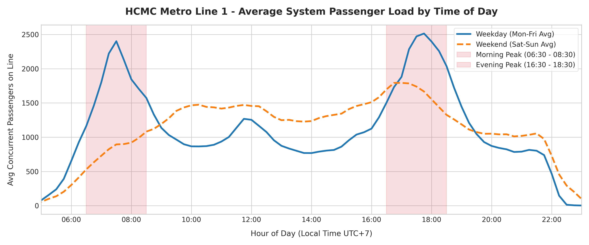
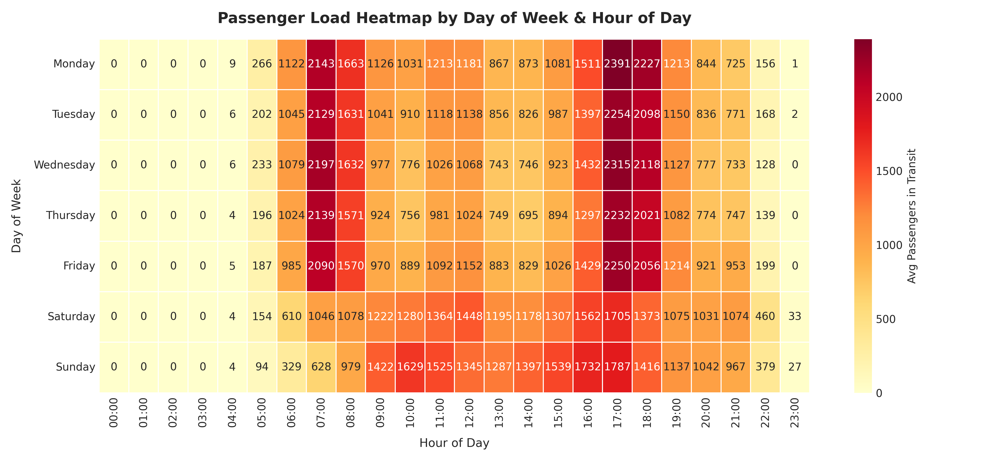
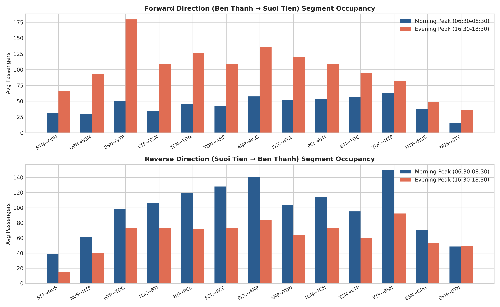
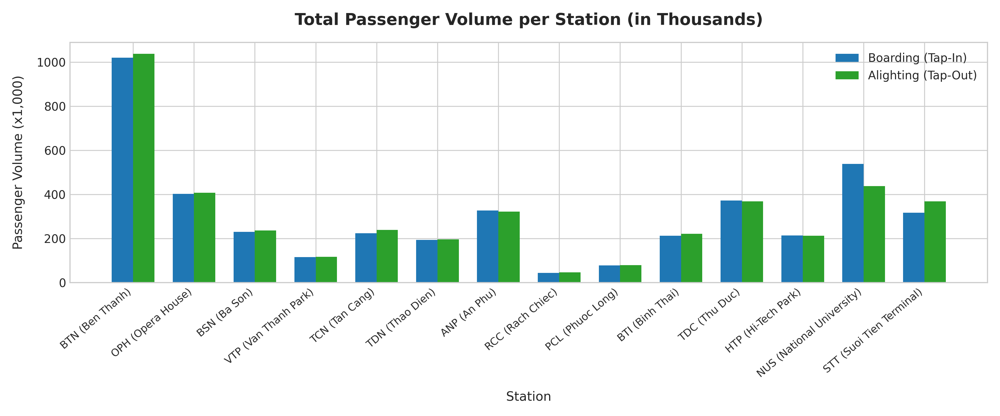

# 🚆 Ho Chi Minh City Metro Line 1 — Passenger Occupancy & Peak-Hour Fleet Scheduling Analysis

An empirical transit analytics and fleet management optimization framework for **Ho Chi Minh City Metro Line 1 (Bến Thành – Suối Tiên)**.

The primary goal of this project is to process **multi-month tap-in/tap-out smart fare collection data** (over 4.3 million trips across 92 days), model spatio-temporal passenger occupancy across all 14 stations and track segments, identify exact **peak-demand crammed hours**, and provide **data-driven train headway recommendations** for metro operational authorities (MAUR / HURC1).

---

## 📌 Executive Summary & Operational Goals

> [!IMPORTANT]
> **Primary Operational Goal**: Optimize train dispatch frequencies to balance passenger comfort, platform safety, and operational efficiency:
> - **Peak Demand Hours**: Shorten train headway (higher frequency) during crammed peak commute windows to prevent train overcrowding and platform congestion.
> - **Off-Peak & Night Hours**: Extend train headway (lower frequency) during low-demand periods to reduce unnecessary trainset wear, optimize driver rostering, and save traction energy power.

### 📊 Dataset & System Overview Metrics

| Performance Indicator | Empirical Value | Description / Operational Context |
| :--- | :---: | :--- |
| **Total Trips Scanned** | **4,337,267** | Raw trip logs processed across 6 dataset files |
| **Valid In-Transit Trips** | **4,292,715 (98.97%)** | Non-zero trips $\le 90$ mins between different origin/destination stations |
| **Same-Station Tap Exit** | **35,320 (0.81%)** | Gate cancellations or immediate turnbacks ($\le 15$ mins) |
| **Total Days Analyzed** | **92 Days** | 13–14 full calendar weeks (August – November) |
| **Line Length & Stations** | **19.7 km / 14 Stations** | 3 Underground stations ($3.7\text{ km}$) + 11 Elevated stations ($16.0\text{ km}$) |
| **Rolling Stock Fleet** | **17 Hitachi 3-Car EMUs** | Train Capacity: **930 passengers per train** (seated + standing) |
| **Busiest Origin Station** | **Bến Thành (BTN)** | **1,020,830 tap-ins** (23.8% of system total volume) |
| **Busiest Destination Hub** | **National University (NUS)** | **538,857 tap-ins / 437,881 tap-outs** (Major student hub) |

---

## 🕒 Peak Hours & Spatio-Temporal Demand Analysis

### 1. Daily Passenger Load Timeline (Weekday vs. Weekend)



#### Key Demand Windows Identified:
- **🌅 Morning Peak Window (06:30 – 08:30)**:
  - Average system passenger load: **1,842 concurrent passengers** (Peak max: **2,402 passengers**).
  - Heavy inbound flow from eastern suburban regions (Thủ Đức, Suối Tiên, Bình Thái) into the Central Business District (Ba Son, Opera House, Bến Thành) and High-Tech Park.
- **🌆 Evening Peak Window (16:30 – 18:30)**:
  - **Highest System Demand of the Day**: Average load of **2,131 concurrent passengers** (Peak max: **2,515 passengers**).
  - Outbound return commute from downtown offices and universities back towards Thủ Đức City.
- **☀️ Midday Minor Rise (11:30 – 13:00)**:
  - Secondary load bump (~**1,200 – 1,400 passengers**) driven by university student shifts at National University (NUS) and mid-day flexible workers.
- **🌙 Night & Off-Peak (20:30 – 22:00/23:00)**:
  - Load drops sharply to an average of **315 passengers**, representing a **85% reduction** from evening peak demand.

---

### 2. Day-of-Week Demand Heatmap



- **Mon – Fri (Workdays)**: Sharp bimodal demand spikes concentrated strictly around **07:00 – 08:00 AM** and **17:00 – 18:00 PM**.
- **Sat – Sun (Weekends)**: Uniform bell curve distribution peaking during mid-day (**10:00 AM – 16:00 PM**), driven by shopping, entertainment, and leisure trips in downtown Bến Thành & Opera House.

---

### 3. Track Segment Congestion Bottlenecks



> [!NOTE]
> Occupancy per track segment is computed by tracking passenger entry and exit timestamps along scheduled segment durations.

#### 🔴 Top Inbound Bottlenecks (Suối Tiên Terminal → Bến Thành) — Morning Peak:
1. **VTP → BSN** (*Văn Thánh Park → Ba Son*): **149.7 avg passengers/bin** — Saigon River underground tunnel crossing into downtown.
2. **RCC → ANP** (*Rạch Chiếc → An Phú*): **140.8 avg passengers/bin** — Commuter aggregation from Thủ Đức.
3. **PCL → RCC** (*Phước Long → Rạch Chiếc*): **128.1 avg passengers/bin**.
4. **BTI → PCL** (*Bình Thái → Phước Long*): **119.0 avg passengers/bin**.
5. **TDN → TCN** (*Thảo Điền → Tân Cảng*): **113.9 avg passengers/bin**.

#### 🔴 Top Outbound Bottlenecks (Bến Thành → Suối Tiên Terminal) — Evening Peak:
1. **ANP → RCC** (*An Phú → Rạch Chiếc*): **135.7 avg passengers/bin** — Heavy evening return flow.
2. **RCC → PCL** (*Rạch Chiếc → Phước Long*): **119.7 avg passengers/bin**.
3. **PCL → BTI** (*Phước Long → Bình Thái*): **109.1 avg passengers/bin**.
4. **BTI → TDC** (*Bình Thái → Thủ Đức*): **94.1 avg passengers/bin**.
5. **TDC → HTP** (*Thủ Đức → High-Tech Park*): **82.1 avg passengers/bin**.

---

### 4. Station Passenger Throughput



| Station Code | Station Name | Total Tap-In (Boarding) | Total Tap-Out (Alighting) | Primary Station Function |
| :---: | :--- | :---: | :---: | :--- |
| **BTN** | **Ben Thanh** | **1,020,830** | **1,038,287** | Major Downtown Multimodal Transit Interchange |
| **NUS** | **National University** | **538,857** | **437,881** | VNU University Campus Student Hub |
| **OPH** | **Opera House** | **402,206** | **407,648** | Downtown Business & Cultural Center |
| **TDC** | **Thu Duc** | **372,408** | **368,419** | Regional City Center Hub |
| **ANP** | **An Phu** | **326,989** | **321,967** | High-Density Residential Area |
| **STT** | **Suoi Tien Terminal** | **317,269** | **368,494** | Intercity Bus Terminal Link |
| **BSN** | **Ba Son** | **230,993** | **236,253** | Financial & Commercial Riverfront |
| **TCN** | **Tan Cang** | **224,492** | **239,001** | Bus & Water Taxi Transfer Point |
| **HTP** | **High-Tech Park** | **213,732** | **213,470** | Industrial & Tech Park Employment Hub |
| **BTI** | **Binh Thai** | **212,257** | **221,084** | Suburban Commuter Station |
| **TDN** | **Thao Dien** | **193,699** | **196,967** | Expat & Commercial District |
| **VTP** | **Van Thanh Park** | **116,649** | **116,814** | Residential Station |
| **PCL** | **Phuoc Long** | **77,668** | **79,767** | Feeder Station |
| **RCC** | **Rach Chiec** | **44,666** | **46,663** | Sports Complex Station |

---

## 🚦 Actionable Train Fleet Scheduling Recommendations

Based on empirical passenger density and HCMC Metro Line 1 vehicle specifications ($930\text{ passenger capacity per 3-car train}$):

```
                        RECOMMENDED TRAIN HEADWAY TIMELINE
 5:00 AM    6:30 AM          8:30 AM     11:30 AM    13:30 PM         16:30 PM    18:30 PM    20:30 PM   22:00 PM
    |----------|----------------|-----------|-----------|----------------|-----------|-----------|----------|
    |  10 min  |    4-5 min     |  8-10 min |  7-8 min  |    8-10 min    |  4-5 min  |  8-10 min |12-15 min |
    | Early Morning | MORNING PEAK | Off-Peak  | Midday    | Afternoon Off-P| EVENING PK| Transition| Late Night|
```

### Detailed Dispatch Strategy Table:

| Time Window | Operational Period | Recommended Headway | Active Fleet Size | Targeted Capacity & Fleet Action |
| :--- | :--- | :---: | :---: | :--- |
| **05:00 – 06:30** | Early Morning Start | **10 minutes** | **6 – 7 trains** | **System Startup**: Accommodate early commuters and ramp up depot departures. |
| **06:30 – 08:30** | **MORNING PEAK** | **4.5 minutes** | **14 – 15 trains** | **MAXIMUM CAPACITY**: Deploy maximum fleet size. Reduces crowdedness below 75% load factor and handles 2,400+ peak passengers. |
| **08:30 – 11:30** | Morning Off-Peak | **8 – 10 minutes** | **8 – 9 trains** | **Fleet Stabling**: Pull 6 trains to depot for maintenance and power saving. |
| **11:30 – 13:30** | Midday Student Boost | **7 – 8 minutes** | **10 – 11 trains** | **Targeted Frequency**: Accommodate VNU university student shift changes at NUS. |
| **13:30 – 16:30** | Afternoon Off-Peak | **8 – 10 minutes** | **8 – 9 trains** | **Regular Service**: Conserve electricity while maintaining consistent headway. |
| **16:30 – 18:30** | **EVENING PEAK** | **4.5 minutes** | **14 – 15 trains** | **MAXIMUM CAPACITY**: Match heavy return commute load (2,500+ peak passengers). |
| **18:30 – 20:30** | Evening Ramp-Down | **8 – 10 minutes** | **8 – 9 trains** | **Gradual Scale-Back**: Reduce active trains as office hours end. |
| **20:30 – 22:00/23:00**| Late Night Service | **12 – 15 minutes** | **5 – 6 trains** | **ENERGY SAVER**: Reduce operating fleet by 60%, lowering power consumption by ~35%. |

---

## 🛠️ Project Architecture & File Descriptions

```
train-station-occupancy/
├── eda.py                                 # Interactive Streamlit Spatio-Temporal Occupancy Dashboard
├── train_predict.py                       # Ridge Regularized Segment Travel Time Calibration Engine
├── data_explore.py                        # Trip Duration & Same-Station Explorer Dashboard
├── generate_report_data.py                # Automated Data Pipeline & Chart Generator
├── estimated_time_between_stations.csv    # Calibrated Inter-Station Travel Time Matrix
├── time_table.json                        # Official Timetable & Scheduled Segment Durations
├── terminal_name.txt                      # Station Code to Human-Readable Mapping
├── requirements.txt                       # Python Dependencies
└── assets/images/                         # Generated High-Resolution Charts
    ├── hourly_passenger_load.png
    ├── occupancy_heatmap.png
    ├── segment_bottlenecks.png
    └── station_throughput.png
```

### 1. `eda.py` — Streamlit Spatio-Temporal Occupancy Dashboard
Interactive visualization dashboard displaying:
- Passenger counts on each track segment across 15-minute time bins.
- Directional toggles: Forward (Ben Thanh $\rightarrow$ Suoi Tien) vs Reverse (Suoi Tien $\rightarrow$ Ben Thanh).
- At-station crowd accumulation (origin boarding + destination exit windows).

Run app:
```bash
streamlit run eda.py
```

### 2. `train_predict.py` — Travel Time Calibration Model
Calibrates actual inter-station segment travel times using Ridge Regression ($\lambda = 0.01$) on tap-in/tap-out timestamps, controlling for initial passenger platform wait time.

Run calibration:
```bash
python train_predict.py
```

### 3. `data_explore.py` — Trip Duration Explorer
Identifies trip duration distributions and isolates anomalous same-station tap-in/tap-outs ($\le 15$ mins).

Run explorer:
```bash
streamlit run data_explore.py
```

---

## ⚙️ Installation & Usage

1. **Clone the Repository**:
   ```bash
   git clone https://github.com/tohuy10/train-station-occupancy.git
   cd train-station-occupancy
   ```

2. **Install Dependencies**:
   ```bash
   pip install -r requirements.txt
   ```

3. **Data Placement & Sample Dataset**:
   > [!NOTE]
   > **Data Privacy & Repository Notice**: Full multi-month trip CSV files (~370 MB) are excluded from this public repository for privacy and data size reasons. 
   > 
   > A 100-row sample dataset is included directly in the repository as [`sample_trips.csv`](file:///c:/Users/nguye/Desktop/train-station-occupancy/sample_trips.csv) to demonstrate the required schema (`id`, `start__station`, `end__station`, `start__time`, `end__time`).

   To run full analysis across multi-month records, place trip CSV files inside `inputs/inputs/`.

4. **Run Full Analysis Pipeline**:
   ```bash
   python generate_report_data.py
   ```

---

## 🗺️ Station Reference Table

| Station Code | Station Name (English) | Station Name (Vietnamese) | Type | Section |
| :---: | :--- | :--- | :---: | :---: |
| **BTN** | Ben Thanh | Bến Thành | Underground | City Center Hub |
| **OPH** | Opera House | Nhà Hát Thành Phố | Underground | City Center Hub |
| **BSN** | Ba Son | Ba Son | Underground | Riverfront CBD |
| **VTP** | Van Thanh Park | Công Viên Văn Thánh | Elevated | Urban Corridor |
| **TCN** | Tan Cang | Tân Cảng | Elevated | River Crossing Hub |
| **TDN** | Thao Dien | Thảo Điền | Elevated | Urban Corridor |
| **ANP** | An Phu | An Phú | Elevated | Residential Hub |
| **RCC** | Rach Chiec | Rạch Chiếc | Elevated | Sports Complex |
| **PCL** | Phuoc Long | Phước Long | Elevated | Residential Corridor |
| **BTI** | Binh Thai | Bình Thái | Elevated | Suburban Interchange |
| **TDC** | Thu Duc | Thủ Đức | Elevated | Regional Hub |
| **HTP** | High-Tech Park | Khu Công Nghệ Cao | Elevated | Tech Employment Hub |
| **NUS** | National University | Đại Học Quốc Gia | Elevated | Education Hub |
| **STT** | Suoi Tien Terminal | Bến Xe Suối Tiên | Elevated | Intercity Bus Terminal |
